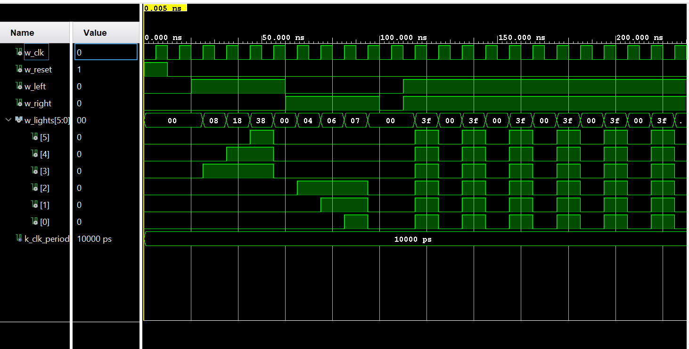

# Lab 3: Thunderbird Turn Signal

VHDL for ECE 281 [Lab 3](https://usafa-ece.github.io/ece281-book/lab/lab3.html)

Targeted toward Digilent Basys3. Make sure to install the [board files](https://github.com/Xilinx/XilinxBoardStore/tree/2018.2/boards/Digilent/basys3).

Built for Vivado 2024.2 on Windows 11.

Doc: Used the lab reprot of Cadet Esssig to finalize and fix my test cases by adding *1 to each clock edge and realizing that it
is cascading one after the other